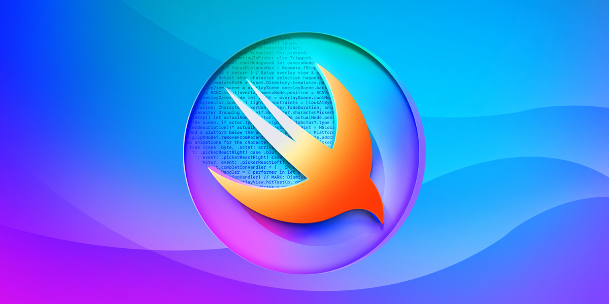

# WWDC 2025 - Swift Student Challenge

List of student submissions for the WWDC 2025 - Swift Student Challenge.

Check out the [YouTube Playlist](https://youtube.com/playlist?list=PL0GynU2GmYtQhEjMX1i8KR3By7SugZEHL&si=k-e0kU_MboQ9uuWM) to watch the projects.

### How to add your submission?
1. [Click here](https://github.com/wwdc/2025/edit/main/Template.md) to fork this repository and edit the `Template.md` file.
2. Fill out the document based on the example in the comment below.
3. Make a new Pull Request and wait for the review.

#### How to update your submission?
If you would like to update your submission status please find your file in `Submission` directory. Edit file, update status and create Pull Request.

### Submissions

| Name | Source |    Video    | Technologies | Status |
|-----:|:------:|:-----------:|:-------------|:------:|
|[Akshat Saladi](https://akshat-hotpage.vercel.app/)|[GitHub](https://github.com/Akshat2923/Hero-Coach)|[YouTube](https://www.youtube.com/watch?v=A0phG_YCdII)|SwiftUI, SwiftData, CreateML, CoreML||
|[Alessio Rubicini](https://alessiorubicini.github.io)|[GitHub](https://github.com/alessiorubicini/Screenplay-Genie)|-|SwiftUI||
|Alexandros Samonakis|[GitHub](https://github.com/AloneAlexandros/SSC2025)|[YouTube](https://youtu.be/qnYDLUdTiG8)|SwiftUI, Vision, AVFoundation, UIKit||
|András Baki|[GitHub](https://github.com/ANDREW414E44524557/findtheapple)|-|SwiftUI, Foundation||
|[Asser Osama](https://www.linkedin.com/in/asserusama/)|-|[YouTube](https://youtu.be/b1dvqV9dZwo?si=Acd2yAONKrWTEb24)|Vision, SwiftUI, AVFoundation||
|[Ayush Srivastava](https://x.com/ayushsrivastv)|[GitHub](https://github.com/ayushshrivastv/ThisSide)|-|SwiftUI, Mapkit, HealthKit||
|[Chawabhon Netisingha (Jnx03)](https://www.jnx03.xyz/)|[GitHub](https://github.com/JNX03/Syntaxia)|[YouTube](https://youtu.be/zJ4cAt7An84)|SwiftUI, Speech synthesis, Natural Language, Avfoundation ||
|[Dhruv Goswami](https://www.linkedin.com/in/Dhruv-Goswami-24-/)|[GitHub](https://github.com/DhruvGoswami10/Error_404-Game_not_found_SSC)|-|SwiftUI, SpriteKit, CoreML||
|[Dyari Bahadin](https://x.com/0dbug_)|[GitHub](https://github.com/0xdbug/Armillary)|[YouTube](https://youtu.be/ogBnf7YMmGY?si=XB_wk4u2zCR9ecPj)|SwiftUI, SceneKit||
|[Francesco Paciello](https://x.com/paciosdev)|[GitHub](https://github.com/paciosdev/Adventure-of-a-Distinguished-Winner-SSC25-)|-|SwiftUI, SpriteKit, AVFoundation, PencilKit||
|[Hunor Zoltáni](https://ronuhz.me)|[GitHub](https://github.com/Ronuhz/Swift-Student-Challenge-2025)|-|SwiftUI, AVKit, Observation||
|[Ian Quibete](https://github.com/nexteurarian)|[GitHub](https://github.com/nexteurarian/TracksAPP)|-|SwiftUI, Foundation||
|[Jack Miller](https://jackmiller.dev)|[GitHub](https://github.com/millerswiftdev/AquaQuest)|-|RealityKit, SwiftData, TipKit||
|[James Deming Kong](https://jameskong098.github.io/)|[GitHub](https://github.com/jameskong098/home-gym)|[YouTube](https://www.youtube.com/watch?v=rw4rHrYH1G0)|SwiftUI, Vision, Charts, AVSpeechSynthesizer||
|[José Alencar](https://www.linkedin.com/in/josevalencar/)|[GitHub](https://github.com/josevalencar/SSC-25)|-|SwiftUI, CoreML, Metal||
|[Kevin Mekic](https://www.linkedin.com/in/kevin-mekic-b5833b170/)|[GitHub](https://github.com/kevinmekic/wwdc2025)|-|SwiftUI||
|[Leandro](https://x.com/Droni0s)|[GitHub](https://github.com/Lxdro/the_Terminal-tor)|-|SwiftUI, AVKit||
|[Lucas Lavajo](https://tryon-lab.fr)|[GitHub](https://github.com/tryon-dev/wwdc2025)|-|SwiftUI, CoreMotion, Vision||
|[Lukas Lauerer](https://www.twitter.com/custusfox)|[GitHub](https://github.com/Black-Fox-2022/SpotOn-SSC25)|-|SwiftUI, AVFoundation||
|[Mhmd Ebrahim](https://www.linkedin.com/in/mhmd-ebrahim)|-|[YouTube](https://youtu.be/QXox8H-kWo0?si=BJue2fhX-Rt0aUUB)|SwiftUI, PS algorithms||
|[Morris Richman](https://mcrich23.com)|[GitHub](https://github.com/Mcrich23/Anchor)|[Video](https://github.com/user-attachments/assets/beb6a3f1-38db-4475-8765-00a0d28a4164)|SwiftUI, Speech, CoreHaptics, PencilKit||
|[Myung Joon Kang](https://myungjoon.com)|-|[Video](https://speechpath.site)|SwiftUI, AVFoundation, Speech||
|[OliverPark](https://www.olivergpark.com)|[GitHub](https://github.com/oliver0828-dev/JeongKimchi)|-|SwiftUI, MapKit, SwiftData||
|[Om Chachad](https://omchachad.com)|[GitHub](https://github.com/OmChachad/DubDubCircle)|[YouTube](https://youtu.be/NkXkQP9AP_g)|SwiftUI, VisionKit, Genmoji, SwiftData||
|[Philipp Ollmann](https://philipp-ollmann.super.site/)|[GitHub](https://github.com/philippollmann/wwdc25-fidgetsynth)|[YouTube](https://youtu.be/NHBF3pVmhHw)|SwiftUI, CoreAudio||
|Raphaël Schröder|[GitHub](https://github.com/raphckrman/WWDC-SSC)|-|SwiftUI, CoreHaptics, SwiftData, UserNotifications||
|[Richard Simonik](https://linkedin.com/in/richard-%C5%A1imon%C3%ADk-6603712a2)|[GitHub](https://github.com/risasim/CPRHelperv2)|-|SwiftUI||
|[Riju Ishiwatari](https://x.com/acrostorn?s=21)|[GitHub](https://github.com/acrostorn/OrbitPlay)|[YouTube](https://www.youtube.com/watch?v=GaSuNM9kLKg)|SwiftUI, ARKit, SceneKit, Charts||
|[Rodrigo Pellanda](https://x.com/pllenin42)|-|[YouTube](https://youtu.be/ic7mI4TN35k)|SwiftUI, SpriteKit, RealityKit, GameplayKit||
|[Roscoe Rubin-Rottenberg](https://knotbin.xyz)|[GitHub](https://github.com/knotbin/ssc-25)|[YouTube](https://youtu.be/GgueyJrMiuQ?si=OmIf2fHv0LlNXYWk)|SwiftUI, Speech, AVFoundation, Combine||
|[Sahil Prasad](https://x.com/sailorworks)|[GitHub](https://github.com/sailorworks/swift25)|-|SwiftUI, RealityKit, Combine||
|[Soleil Chao](https://www.linkedin.com/in/soleil-chao/)|-|-|SwiftUI, AVFoundation||
|[Theeratdolchat Chatchai](https://github.com/Theerat22)|[GitHub](https://github.com/Theerat22/ReKeeper)|[YouTube](https://youtu.be/hx3YWWz6F28?si=N1tH4uGe8BwLjn3d)|SwiftUI, AVFoundation, Vision, PhotosUI||
|[Venus Bhatia](https://x.com/venusbhatia)|-|[YouTube](https://www.youtube.com/shorts/6smlF4eMXp8)|SwiftUI||
|[Vitória Beltrão](https://www.linkedin.com/in/vitoriabeltrao/)|[GitHub](https://github.com/vbwo/Emotionpedia-SSC25)|[YouTube](https://www.youtube.com/watch?v=I3oGPtrsfME)|SwiftUI, ARKit, RealityKit, Vision||

##### Total: 35 | Awarded: 7
